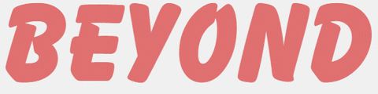

<pre align="center">
When you strive to comprehend your code, you a create better workflow 
and become better at what you do. Your code isn't just your job anymore,
it's your craft.
</pre>
<h1 align="center"> Tech stack</h1>
<p align="center">
     
     
</p>  
<p align="center">
I'm a student at Jomo Kenyatta University Of Agriculture And Technology pursuing a computer science degree. My interest in tech is Web and building microservice infrastructure on the cloud. 
</p>  

<h1 align="center">My GitHub stats </h1>
  <table align="center">
  <tr>
      <td></td>
      <td></td>      
  </tr>   
</table>
<p align="center">
I participate in open source by building software products that impacts developers and users.
Open source is where my mind goes open and learning tech is my full-time job. 
  </p>
<br>

<h1 align="center"> My Weekly Coding Stats⌚ </h1>

<p align="center">
```Once swam to the end of an infinity pool, no thought 💭 goes unpublished```

</p>
<br>

<pre align="center">    GitHub is my corner of the internet</pre>
